# Film Fanatic

[This project](https://pvieira04.github.io/filmfanatic/) is now live on Github Pages.

FilmFanatic is a site where users can play a quiz game which is all about film.

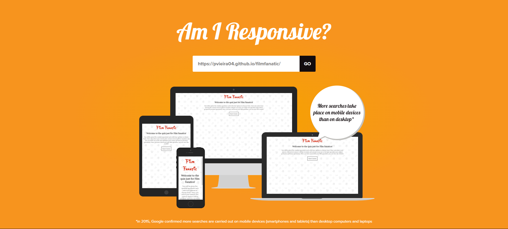

## [Contents](#contents)

* [User Experience (UX)](#user-experience-ux)
  * [Key Project Goals](#key-project-goals)
  * [Target Audience](#target-audience)
  * [User Goals](#user-goals)
  * [User Story](#user-story)
* [Planning](#planning)
  * [Strategy](#strategy)
  * [Scope](#scope)
  * [Structure](#structure)
  * [Skeleton](#skeleton)
  * [Surface](#surface)
  * [Review with Mentor](#review-with-mentor)
* [Technology](#technology)
  * [Languages](#languages)
* [Design](#design)
  * [Colour Scheme](#colour-scheme)
  * [Typography](#typography)
  * [Accessibility](#accessibility)
  * [Imagery](#imagery)
  * [Wireframes](#wireframes)
* [Features](#features)
  * [The Landing Page](#the-landing-page)
  * [Features Left to Implement](#features-left-to-implement)
* [Testing](#testing)
* [Deployment](#deployment)
* [Credits](#credits)
  * [Content](#content)
  * [Media](#media)

## User Experience (UX)

### Key Project Goals
1. Create a functional quiz which has five static questions.
2. Create a JSON file which contains quiz questions & allow JS to pull them.
3. Change JSON file to contain only film information and make questions in real time.
4. Randomise questions being asked.
5. Increase number of films stored in JSON.
6. Connect to an API to pull film information from instead.

### Target Audience

- All demographics. 

### User Goals

- Wants to play a quiz based on film knowledge

### User Story

- User lands on website and reads the welcome message. User understands the rules of the game and so clicks on the start game button. They answer the first question and get immediate feedback on whether the answer is correct or not. They click on the button to bring up the next question and continue this process until answering the fifth and final question. Upon answering, user reads the feedback and then clicks on the button to show results.

## Planning
In this section, I outline the initial planning stages for this project.

### Strategy

---
| **Opportunity / Problem** | **Importance** | **Viability / Feasibility** | **Difficulty** |
|-----------------------------|:-:|:-:|:-:|
| Ask question using a uniform template | 5 | 5 | 1 |
| Generate 4 answers, 1 being correct, 3 being incorrect | 5 | 5 | 2 |
| Next question replaces the answered question | 5 | 5 | 1 |
| Ensure no repeating of questions | 5 | 5 | 1 |
| Score tracker | 5 | 5 | 1 |
| Welcome message | 5 | 5 | 1 |
| Ask questions using a range of different templates | 5 | 5 | 2 |
| Animations for correct answers | 4 | 5 | 2 |
| Allow user to select decade of movies involved in quiz | 4 | 5 | 3 |
| Pull question information from an API | 1 | 2 | 5 |
| Create a leaderboard | 2 | 3 | 4 |
---

Sum of Importance = 46
Sum of Viability = 50

Viability >= Importance so therefore, I could implement all features.

### Scope

- Taking into account the difficulty of each potential feature, I will be leaving out the last three features in my Minimum Viable Project. I will code my project with the aim of adding these features at a later date.

The following features are my scope for this project:
- Ask question using a uniform template	
- Generate 4 answers, 1 being correct, 3 being incorrect	
- Next question replaces the answered question	
- Ensure no repeating of questions	
- Score tracker	
- Welcome message	
- Ask questions using a range of different templates	
- Animations for correct answers	

### Structure

This will be the flow of how the user will navigate the website:

1. Welcome message + instructions + start game button
2. Question one
3. Question two
4. Question three
5. Question four
6. Question five
7. Results

### Skeleton

For My skeleton, I wanted to have the layout for 5 different sections:
1. Welcome message + instructions + start game button
2. Question display - unanswered
3. Question display - answered correctly with message and next question button
4. Question display - answered incorrectly with message and display results button
5. Results

### Surface

- I want this site to be bright, with lots of colour and images. I want typography which also reflects that.
- Key word: Bubbly. I want my text to be bubbly and fun.

### Review with Mentor

- Since this is a front-end project, it would be unwise to use an API. This is becasue any API keys that I include are not protected and anyone could end up using the keys for themselves.
- This means I will be unable to achieve the sixth project goal.
- However, I will be able to simulate an API call and show that it works as a proof of concept.

## Technology

### Languages

- HTML5 - The latest version of HTML. Allows content to be placed on the website.
- CSS3 - The latest version of CSS. Allows for custom styling of HTML elements.
- JavaScript - The latest version of vanilla JavaScript. Allows for extensive interactability with the user.

## Design

### __Colour Scheme__

- #FAFAFA, Platinum: Used for the background of the website.
- #D8321C, Crimson: Used for the website logo at the top of the page.
- #FFFFFF, Black: Used for general text on the site.

[Crimson on Platinum Background](https://coolors.co/contrast-checker/d8321c-fafafa)

Since the Crimson colour is only used on large text, this colour combination is good enough for any accessibility requirements.

### __Typography__

- The website logo's font uses a custom font called Waltograph. This is a style inspired by Disney and keeps the website on-theme while also giving it a playful feel.
- The rest of the site uses the Lora font which I think complements Waltograph quite well.

### __Accessibility__

- For Keyboard only users, I have implemented a feature where when a question has been answered, the tab focus goes straight to the next question button. This saves the user time to tab through the rest of the buttons.

- Text elements have a shadow added to them so that text appears clearer on the themed background.

- Contrast between colours is high enough to accommodate users with visual impairments up to WCAG level AAA.

### __Imagery__

- The background for the site features several repeating icons relating to film such as a projector, a camcorder, a cd, popcorn and 3D glasses.

### __Wireframes__

  ### Welcome and Instructions Mockups
  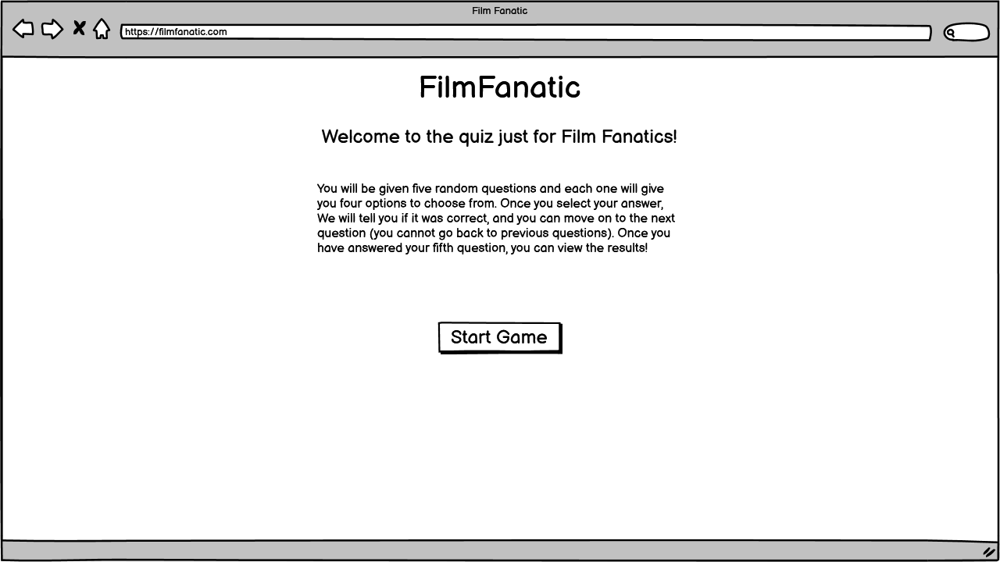

  [Welcome and Instructions Mockup - Tablet Version](./assets/media/wireframes/welcome-instructions-start-tablet.png)

  [Welcome and Instructions Mockup - Mobile Version](./assets/media/wireframes/welcome-instructions-start-mobile.png)

  ### Unanswered Question Mockups
  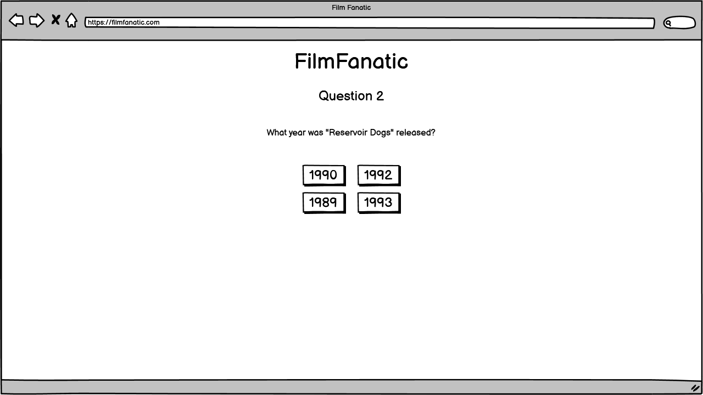

  [Unanswered Question Mockup - Tablet Version](./assets/media/wireframes/question-unanswered-tablet.png)

  [Unanswered Question Mockup - Mobile Version](./assets/media/wireframes/question-unanswered-mobile.png)

  ### Correctly Answered Mockups
  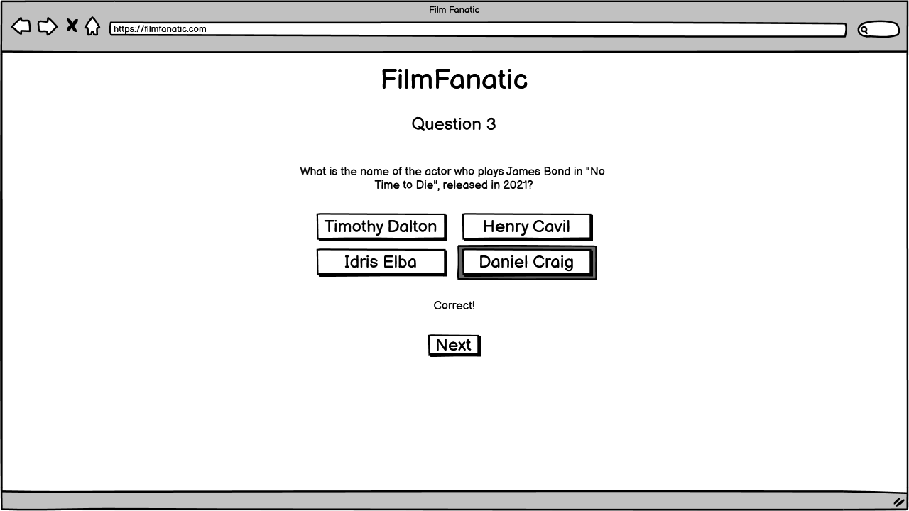

  [Correctly Answered Mockup - Tablet Version](./assets/media/wireframes/question-answered-correct-tablet.png)

  [Correctly Answered Mockup - Mobile Version](./assets/media/wireframes/question-answered-correct-mobile.png)

  ### Incorrectly Answered Mockups
  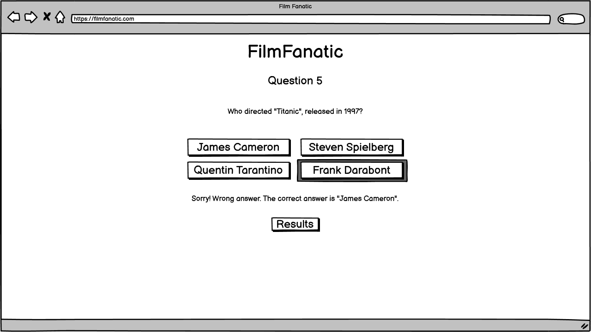

  [Incorrectly Answered Mockup - Tablet Version](./assets/media/wireframes/question-answered-wrong-tablet.png)

  [Incorrectly Answered Mockup - Mobile Version](./assets/media/wireframes/question-answered-wrong-mobile.png)

  ### Results Mockups
  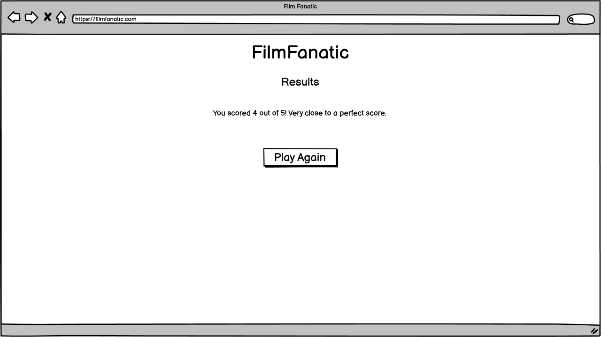

  [Results Mockup - Tablet Version](./assets/media/wireframes/results-tablet.png)

  [Results Mockup - Mobile Version](./assets/media/wireframes/results-mobile.png)

## Features

### Welcome

  - This is what the user will see upon loading the website.
  - They will see the website logo, a welcome message, instructions on how to play, and a start game button.
  - The "Start Game" button is the only interactable item on this page.

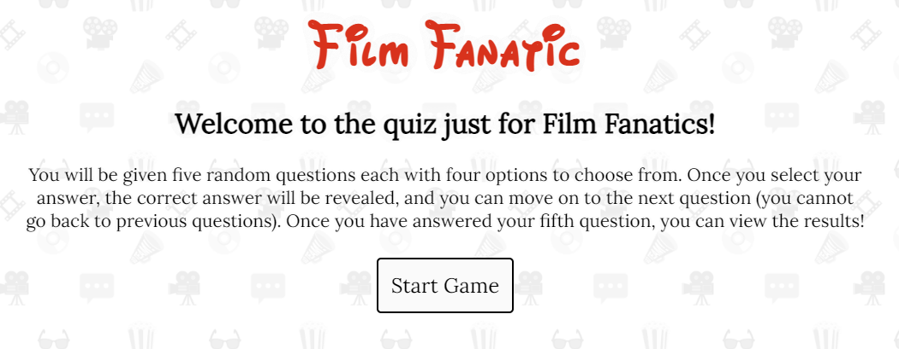

### Local Storage

  - If the user has visited the website before and started the quiz, local storage will activate the hidden "Load Game" button.
  - This makes it so, when clicked, the user is redirected to the state the game was in when they closed the tab.

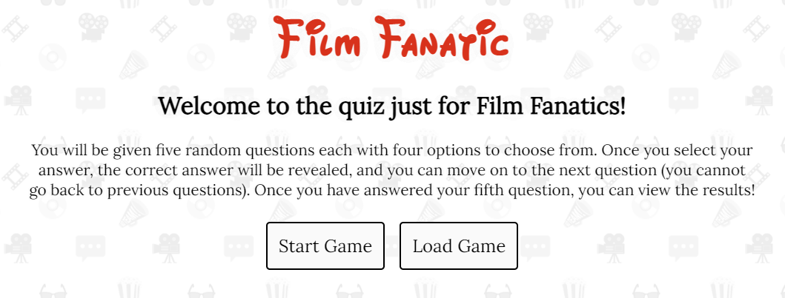

### Option Selection

  - Once the "Start Game" button is clicked, a question will be generated along with four options to choose from; one of which is the correct answer.
  - The question type is generated randomly, as well as the film that is chosen as the subject ofthe question.
  - To ensure the selected film is not repeated in any subsequent questions, the id of that film is added to an array. This array is checked every time a question is to be created.

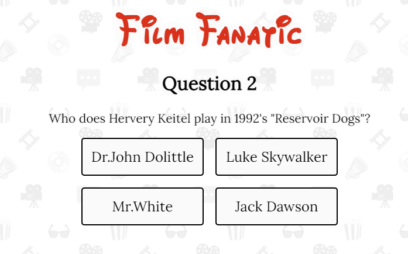
  - [Unanswered Question - Mobile](./assets/media/features/film-fanatic-unanswered-mobile.png)

### Feedback

  - Upon selecting one of the four options, the user will receive feedback on whether they got the question correct or not.
  - Colour is used for the user to easily identify whether their chosen option is the correct answer, as well as a message, for those who are hard of seeing.
  - When selecting the wrong answer, the user will be told in this messsage what the correct answer is.
  - A button is also displayed, which takes the user to the next question, if they choose the press it.

  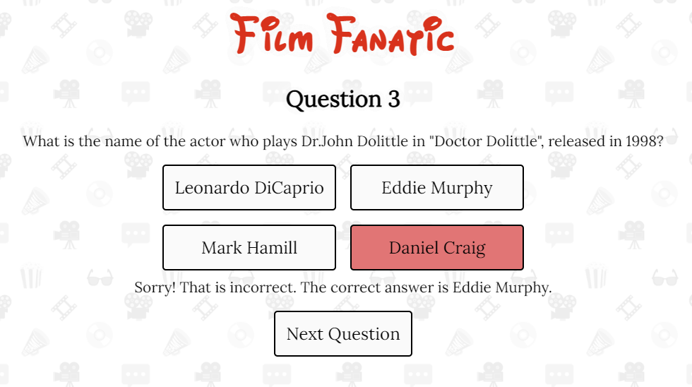
  - [Question Answered Inorrectly - Mobile](./assets/media/features/film-fanatic-incorrect-mobile.png)
  - [Question Answered Correctly - Desktop](./assets/media/features/film-fanatic-correct-desktop.png)
  - [Question Answered Correctly - Mobile](./assets/media/features/film-fanatic-correct-mobile.png)

### Results

  - This shows the total number of questions that the user got correct.
  - A button is also shown below the results which can allow the user to play the quiz from the beginning.
  - The quiz that is generated upon playing again is completely randomised so it is possible for the user to receive the exact same qeustions in the exact same order, however this event is so unlikely that guarding against this is not considered.

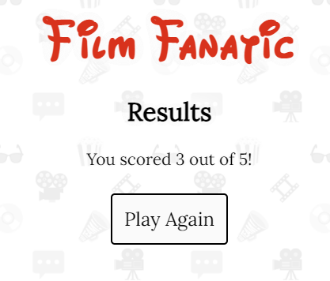

### Fetching Data

  - In order to retrieve film data, the code fetches data from an external endpoint.
  - This endpoint originates from another repository which was set up in order to host the mini database of five films which were used for this project.
  - In case the code is not able to pull from this external endpoint, the code instead pulls the information from a JSON file which is located in this respository.
  - The code does this by using the "try" and "catch" keywords.

### Features Left to Implement

- With regards to the initial scope of the project, all features have been implemented.
- However, additional features can be implemented at another stage.

### Future Features

- In order to achieve the original sixth project goal of using an API, a back end can be built to support the fully functioning front end. This will allow the safe use of an API where a key is needed.
- For the option selection function in JavaScript, a more intelligent system of selecting options can be implemented. For example, if a year is given as the answer, the code will generate three random year which are close but not the same as the target year. That way, if a film was released in 1977, an option of 2021 would not come up.
- Add different kinds of questions regarding awards received from different institutions such as the Oscars, Golden Globes etc.
- Add a functionality for users to select how many questions they wish to answer.

## Testing 

Please refer to the [TESTING.md](./TESTING.md) file.

## Deployment

The site was deployed to GitHub pages. The steps to deploy are as follows: 
  - In the GitHub repository, navigate to the Settings tab .
  - Under the "Code and automation" section, click on "Pages"
  - Under "Build and Deployment", select the option "Deploy from a branch" for "Source", and for "Branch", select "main".

[This is the live website](https://pvieira04.github.io/filmfanatic/)

## Credits 

### Content 

- Thank you to [Code Institute](https://codeinstitute.net/) for giving me the knowledge I needed to complete this project, specifically thier tutorials on how to manipulate the DOM with JavaScript.
- Thank you to my mentor Can Suculu for assisting me with understanding APIs and ensuring I do not use any API keys in this front-end only project.
- Thank you to Joel Olawanle for his [blog post](https://www.freecodecamp.org/news/how-to-read-json-file-in-javascript/) on reading JSON files in JavaScript.
- Thank you to Dmitri Pavlutin for his [blog post](https://dmitripavlutin.com/javascript-fetch-async-await/) on using fetch with async / await.
- Thank you to W3 Schools for [their post](https://www.w3schools.com/html/html5_webstorage.asp) on HTML web storage. It was invaluable in learning the uses and limitations of Local Storage which I used in my project.

### Media

- Thank you to [patternico](https://patternico.com) for allowing me to use your free tool to generate a seamless background to my site.