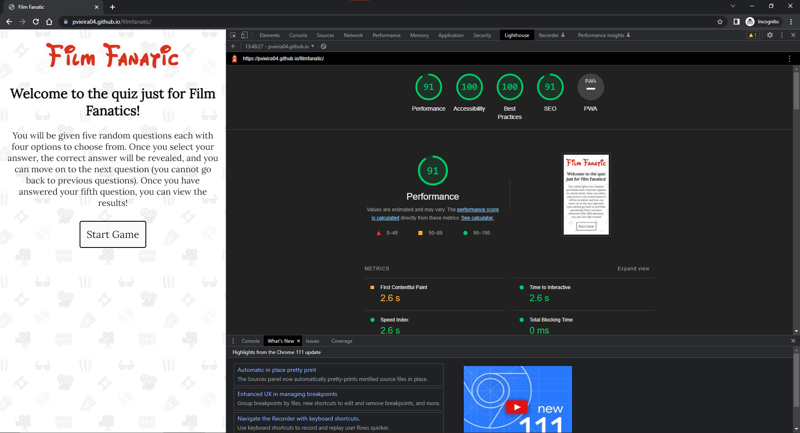
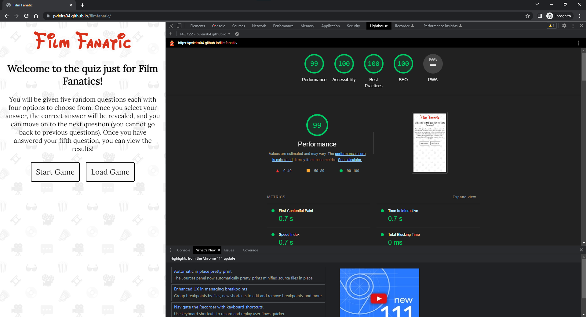

# Testing

This file contains all the different tests performed on the site. It also details the actions taken and any results of those actions.

## Validator Testing

- HTML: [index.html](./index.html) returned no errors when passed through the official [W3C validator](https://validator.w3.org/nu/?doc=https%3A%2F%2Fpvieira04.github.io%2Ffilmfanatic%2F).
- CSS: [style.css](./assets/css/style.css) returned no errors when passed through the official [jigsaw validator](https://jigsaw.w3.org/css-validator/validator?uri=https%3A%2F%2Fpvieira04.github.io%2Ffilmfanatic).
- JavaScript [main.js](./assets/main.js) returned no errors when passed through the official Jshint linter.

## Manual Testing

The main things which manual testing needs to check is the score updating correctly and seeing if the use of local storage is used appropriately.

The manual testing for this project is as follows:

1. Do the quiz getting correct answers to check if the score updates correctly and restart game.
2. Do the quiz getting all incorrect answers to check if the score updates correctly and restart game.
3. Do the quiz getting a mix of correct and incorrect answers to see if the score updates correcly and restart game.
4. Open question 1, refresh page, click on "Load Game", check if question 1 loads from previous save point. Also continue game to the end to check if score updates correctly and if films are repeated.
5. Answer question 1, refresh page, click on "Load Game", check if question 1 loads from previous save point. Also continue game to the end to check if score updates correctly and if films are repeated.
6. Repeat steps 4 and 5 for all subsequent questions.

## User Testing

I have asked many different users to test the website and all have gone through the game without issues. None of my initial testers closed or refreshed the page before the quiz was over. Therefore, in later user testing, I asked the user to pick a random point in their progress and refresh the page and load the game. All users that did this had no issues with the game.

## Browser Testing

- Chrome: Developed on this browser. Site functions and displays as intended.

- Firefox: Site functions and displays as intended.

- Edge: Site functions and displays as intended.

- Opera: Site functions and displays as intended.

- Safari: Site Functions as intended, However a small part of the top of the site logo is cut off. It appears the h1 container is smaller than it should be. On Chrome, the height is 98px wheras on Safari it is only 56px.

## Device Testing

- One Plus 6: Works as intended. Previous issue with h1 element has been resolved.
- Samsung S21 FE: Works as intended.

## Lighthouse Report

Before

Actions
- Add a meta description to index.html to increase SEO score.
- Fix the Flash of Invisible Text (FOIT) for the h1 tag when loading the page.

Mobile

Desktop

## Fixed Issues

- Upon introducing local storage into my project, many functions needed to be changed in order to accommodate. Errors were happening and sometimes the score did not update correctly when loading from local storage. This particular issue was fixed by changing the place in the code where the score is updated and saved to local storage.

- Another issue happened that when loading from local storage, the answer buttons would not load up. This is because of a line of code which clears that container. The line of code was intended to be used just to clear the "Start Game" and "Load Game" functions but since I called the "displayQuestion" function before then, I did not realise the code would still run that line.

- Several issues were encountered when calling from local storage because I did not realise that all values in the local storage object can only be saved as strings. This was fixed using various methods to parse them before using them in the code, such as converting to numbers or to arrays.

- Safari browser and mobile devices had the h1 container for the page shorter than it should be, cutting off the top of the text. This is now fixed and the solution was to include multiple formats for the browser to choose from. I previously only included the Open Type Font (otf) format.

## Known Issues

- There has been an error where, when loading from local storage, a method would not function correctly and return a "-1" rather than a positive integer. I have not been able to replicate the error in my testing, nor have I seen this error being thrown in any of my testing since then. The issue seems to have resolved but safely documenting it here in case it crops up again.